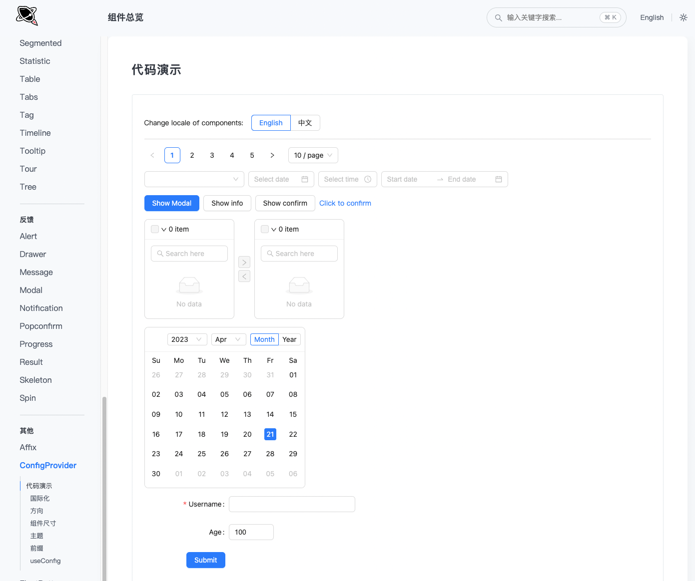

# OpenSumi Ant Design Theme



## Usage

### css external

```js
import '@opensumi/antd-theme/lib/index.css';
```

```jsx
import { ConfigProvider } from 'antd';

// ...

return (
  <ConfigProvider prefixCls="sumi_antd">
    <App />
  </ConfigProvider>
);
```

## Developement

- 找到你要覆盖的 antd 组件
- 在 `src` 下新建一个 `${组件名}.less`
- 在 `src/index.less` import 这个文件
- npm run start 即可开始开发对应组件

### Tips

- `antd.less` 基本涵盖 antd 中所有的变量和值，可供快速参考查阅
- 更完整的 antd 的 less 变量请参见 antd repo 源码
- [Open Sumi Tokens 表](https://github.com/opensumi/core/wiki/%E5%9F%BA%E7%A1%80%E9%A2%9C%E8%89%B2)

### Thank You

- [vagusX](https://github.com/vagusX)
- [suyu34](https://github.com/suyu34)

## FAQ
### 根节点错误导致样式失效问题
在 Antd 组件库中，对于 Dialog、Overlay、Popover 等组件会通过在顶层通过 createPortal 的方式在 组件树顶层插入根节点。当插件注册的视图中使用到这些组件时，由于 portal 的特性，会导致这类组件被插入在插件视图槽（即插件 ShadowDOM）外部，而又因为 ShadowDOM 的隔离性，插件中对这类组件的自定义样式都无法生效，因为插件的 head 样式只会被插入到它自身所在的 ShadowDOM 内。

在 Antd 中，这类组件一般会提供一个 getContainer 的 props，用于指定它们所挂载的 DOM 根节点，可以将 container 设置为插件所注册组件的根元素，例如

```jsx
// antd Modal
import Modal from 'antd/lib/modal';

const MyPanel = () => {
  const rootRef = React.createRef();
    return (<div ref={rootRef}>
    <Modal getContainer={() => rootRef.current}>{content}</Modal>
  </div>
};


// antd Popover

import Popover from 'antd/lib/popover';

const MyPanel = () => {
  const rootRef = React.createRef(null);
    return (<div ref={rootRef}>
    <Popover getPopupDomNode={() => rootRef.current}>{content}</Popover>
  </div>
};
```

### 合成事件问题
由于 React 基于事件委托实现的合成事件依赖 DOM 树根节点，在某些组件中(如 antd/popover) 可能无法捕获到其子组件冒泡上来的事件，这会导致这类组件的子组件们事件处理程序失效，建议使用 react-shadow-dom-retarget-events 手动将事件委托的根节点指定到上述的 container 组件中，例如
```jsx
import Popover from 'antd/lib/popover';
import retargetEvents from 'react-shadow-dom-retarget-events';

const MyPanel = () => {
  const rootRef = React.createRef(null);
    return (<div ref={rootRef}>
    <Popover getPopupDomNode={() => {
    retargetEvents(rootRef.current);
        return rootRef.current;
    }}>{content}</Popover>
  </div>
};
```

